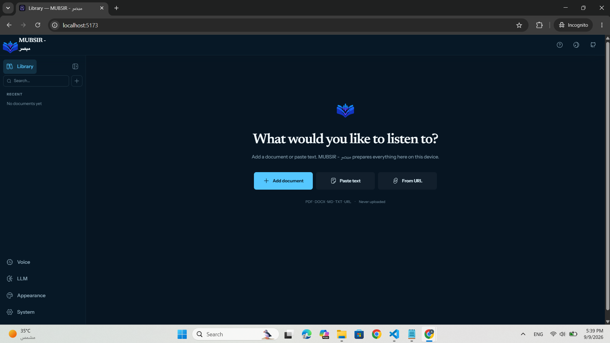

<p align="center">
  
</p>

<h1 align="center">MUBSIR - مبصر</h1>

<p align="center">
  Turn documents into expressive, private speech — entirely in your browser.
</p>

<p align="center">
  <a href="https://ahmeddev374.github.io/Mubsir/"><strong>Open MUBSIR - مبصر</strong></a>
  ·
  <a href="#what-you-can-do">Features</a>
  ·
  <a href="#run-it-locally">Run locally</a>
</p>

<p align="center">
  <a href="https://github.com/AhmedDev374/Mubsir/actions">
    
  </a>
  <a href="https://github.com/AhmedDev374/Mubsir/actions">
    
  </a>
  <a href="https://github.com/AhmedDev374/Mubsir/releases">
    
  </a>
  <a href="./LICENSE">
    
  </a>
</p>

<p align="center">
  <a href="https://ahmeddev374.github.io/Mubsir/">
    
  </a>
</p>

## About MUBSIR

**MUBSIR (مبصر)** is a local-first document reader designed for people who prefer to listen rather than read.

Add a PDF, Word document, Markdown file, plain-text file, or pasted text, and MUBSIR transforms it into a persistent listening experience with natural speech, precise read-along highlighting, and full playback controls.

MUBSIR also handles content that traditional text-to-speech systems struggle with. Equations, tables, diagrams, images, and code can be transformed into understandable spoken descriptions using language models.

There is no account and no MUBSIR backend. Documents, reading progress, generated audio, and settings remain on your device.

MUBSIR supports free on-device AI models as well as optional bring-your-own-key integrations for premium AI and voice providers.

## Get Started

1. Open the [live MUBSIR application](https://ahmeddev374.github.io/Mubsir/).
2. Choose your speech and description engines.
3. Install the free on-device models or configure your own API keys.
4. Add a document or paste text into your library.
5. Press Play and start listening.
6. Return later and continue from where you stopped.

WebGPU provides the best experience for the on-device AI engines. Supported browsers can use compatibility fallbacks when WebGPU is unavailable, although generation may be slower.

## What You Can Do

* 📚 Maintain a private document library with persistent reading progress.
* 🔊 Convert documents into natural spoken audio.
* 🧠 Generate spoken descriptions for equations, tables, diagrams, images, and code.
* 🤖 Use on-device AI or bring your own Claude, GPT, or Gemini API key.
* 🎙️ Use built-in voices or connect ElevenLabs for premium voices.
* ⚡ Adjust playback speed from 0.5× to 3×.
* ⏪ Jump backward or forward by ten seconds.
* 🎯 Start playback from any passage.
* ✨ Follow narration with sentence- and word-level highlighting.
* 🔗 Prevent URLs and links from being read as confusing character sequences.
* 💾 Prepare complete documents for uninterrupted listening.
* 🎵 Export completed audio as MP3.
* ⌨️ Use keyboard shortcuts for playback and navigation.
* 🖥️ Use fullscreen reading and document zoom.
* 🎨 Choose between multiple reading themes.
* 📴 Reopen previously prepared documents while offline.

## Document Support

| Format      | Support                                                                                         |
| ----------- | ----------------------------------------------------------------------------------------------- |
| PDF         | Structured extraction to Markdown, including headings, tables, and mathematical content         |
| DOCX        | Headings, paragraphs, lists, links, quotes, tables, and semantic content                        |
| Markdown    | GFM, task lists, alerts, tables, syntax-highlighted code, math, diagrams, images, and safe HTML |
| TXT         | BOM-aware UTF-8 text import                                                                     |
| Pasted Text | Plain text or automatically detected Markdown                                                   |

Scanned PDFs that require OCR are detected and reported instead of silently producing an empty or corrupted document.

## The Reader

The MUBSIR reader places the document at the center of the experience, with navigation and playback controls designed around listening.

The reader provides:

* Document outline and navigation
* Playback controls
* Reading progress
* Audio caching status
* Sentence and word highlighting
* Spoken descriptions for complex content
* Editable and regenerable descriptions
* Document zoom
* Fullscreen reading
* Responsive mobile controls

Equations, diagrams, tables, images, and code can be highlighted while their descriptions are spoken. Each supported construct can also expose an expandable panel where its generated description can be reviewed, edited, or regenerated.

### Keyboard Shortcuts

| Key     | Action                  |
| ------- | ----------------------- |
| `Space` | Play / Pause            |
| `J`     | Backward 10 seconds     |
| `L`     | Forward 10 seconds      |
| `[`     | Decrease playback speed |
| `]`     | Increase playback speed |

## Speech Engines

MUBSIR includes a free on-device speech engine powered through ONNX Runtime in a dedicated browser worker.

The speech model is downloaded once after accepting its license terms. After installation, speech generation runs locally and can use WebGPU acceleration when available.

MUBSIR generates the current passage first, buffers upcoming passages, and stores generated audio locally to avoid unnecessary regeneration.

### Premium Voices

Users can optionally provide an ElevenLabs API key and select their own voices.

This enables premium voice generation and native word-level timing for accurate read-along highlighting.

## Spoken Descriptions

Some document content cannot be read naturally by traditional text-to-speech systems.

MUBSIR uses language models to transform:

* Equations
* Tables
* Diagrams
* Images
* Source code

into concise spoken descriptions.

Descriptions are generated in the background while listening and are cached with the document.

### On-Device AI

A small local language model can generate descriptions directly on the user's device.

This provides:

* No external API requirement
* Local processing
* Improved privacy
* No per-request API cost

Desktop WebGPU is recommended for the best experience.

### Bring Your Own Key

Users can optionally use their own API keys with supported providers such as:

* Claude
* GPT
* Gemini

Image-aware models can also generate descriptions from embedded image content.

### Description Styles

MUBSIR supports multiple description styles:

* **Concise** — short and direct
* **Balanced** — the default balance between detail and brevity
* **Educational** — explains concepts more thoroughly
* **Custom** — allows users to edit the underlying prompts

Every generated description can be edited and regenerated independently.

## Privacy First

MUBSIR follows a local-first architecture.

* Documents are processed directly in the browser.
* Documents are not uploaded to a MUBSIR server.
* Library data is stored locally using IndexedDB.
* Reading progress is stored locally.
* Generated audio is stored on the device.
* API keys remain in the browser and are sent only to their configured provider.
* AI model downloads connect directly to the model host.
* Normal reading does not require a MUBSIR backend.
* There is no MUBSIR account system.
* There is no advertising.
* There is no analytics or telemetry.

Everything MUBSIR stores can be reviewed and removed through the application's Settings.

## Architecture

MUBSIR is designed around a browser-first architecture:

```text
                    ┌─────────────────────┐
                    │       MUBSIR        │
                    │    Web Application  │
                    └──────────┬──────────┘
                               │
              ┌────────────────┼────────────────┐
              │                │                │
              ▼                ▼                ▼
       Document Parser   Speech Engine    AI Descriptions
              │                │                │
              ▼                ▼                ▼
          Markdown       ONNX Runtime     Local AI / APIs
              │                │                │
              └────────────────┼────────────────┘
                               ▼
                     Browser Local Storage
                            IndexedDB
```

The architecture keeps the core reading workflow inside the browser while allowing optional external AI providers when the user chooses to configure them.

## Run It Locally

MUBSIR requires:

* Node.js 24+
* npm
* A modern browser

Clone the repository:

```bash
git clone https://github.com/AhmedDev374/Mubsir.git
cd Mubsir
```

Install dependencies:

```bash
npm ci
```

Start the development server:

```bash
npm run dev
```

Then open the local URL printed by Vite.

## Production Build

To create a production build:

```bash
npm run build
```

To preview the production build locally:

```bash
npm run preview
```

## Current Limitations

MUBSIR is under active development.

The following features are currently unavailable or limited:

* OCR for scanned documents
* Legacy `.doc` import
* EPUB import
* HTML import
* Cloud synchronization
* Voice cloning

Large on-device AI models can require significant memory. Older computers and mobile devices may therefore generate speech more slowly than desktop systems with WebGPU acceleration.

## Project Status

MUBSIR is actively being developed with a focus on:

* Accessibility
* Privacy
* Local AI
* Document understanding
* Natural speech
* Inclusive digital reading

The project aims to make complex digital documents easier to understand through an interactive listening experience.

## Acknowledgments

MUBSIR builds upon the architecture of the open-source Voicebook project by NeoVand, released under the MIT License.

MUBSIR adapts and extends the project with additional functionality, Arabic-first localization, accessibility-focused features, branding, and a local-first document listening experience.

## License

MUBSIR is released under the MIT License.

See the [LICENSE](./LICENSE) file for the complete license text.

Third-party components and their respective licenses are listed in [THIRD_PARTY_NOTICES.md](./THIRD_PARTY_NOTICES.md).

---

<p align="center">
  <strong>MUBSIR — مبصر</strong><br>
  Making documents easier to hear, understand, and access.
</p>
